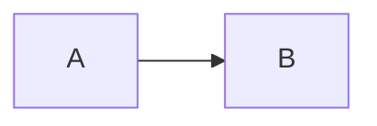

# Conversion Rules

playpark blog (MDX) → Zenn/Qiita 変換ルール詳細。

## プラットフォーム差別化の原則

**ZennとQiitaで切り口を変える** - 同一内容の重複投稿を避ける

### タイトルの付け方

| Platform | パターン | 例 |
|----------|---------|-----|
| **Zenn** | How型（実装・パターン） | 「{技術名}の実装パターン」「{テーマ}で分かったN個のこと」 |
| **Qiita** | Why型（理由・背景） | 「なぜ{技術名}でこう実装するのか」「なぜ{テーマ}を検証したか」 |

### 構成の違い

| | Zenn | Qiita |
|--|------|-------|
| 冒頭 | TL;DR（結論先行） | 学べること（背景先行） |
| 本文開始 | コード例から | 課題・背景から |
| コード比率 | 多め | 少なめ |
| 解説比率 | 少なめ | 多め |
| 読後感 | 「すぐ使える」 | 「判断できる」 |

### カテゴリ別の切り口

| Category | Zenn版 | Qiita版 |
|----------|--------|---------|
| tech-tips | 実装パターン・コード例中心 | 技術選定理由・比較検討中心 |
| lab-reports | 検証結果・発見した知見 | 実験の背景・動機・Why |

## Frontmatter Conversion

### Zenn Format

```yaml
---
title: "記事タイトル"
emoji: "🚀"
type: "tech"
topics: ["nextjs", "react", "typescript"]
published: true
---
```

| Field | Source | Rule |
|-------|--------|------|
| title | title | そのまま使用（【】は残す） |
| emoji | category | カテゴリから自動選択 |
| type | category | tech-tips/lab-reports → tech, その他 → idea |
| topics | tags | 小文字化、最大5個 |
| published | - | true |

### Qiita Format

```yaml
---
title: "記事タイトル"
tags:
  - name: Next.js
    version: "16"
  - name: React
private: false
---
```

| Field | Source | Rule |
|-------|--------|------|
| title | title | そのまま使用 |
| tags | tags | タグ名とバージョン分離（可能なら） |
| private | - | false |

## Emoji Mapping by Category

| Category | Emoji Options |
|----------|---------------|
| tech-tips | 🛠️ 💡 ⚙️ 🔧 |
| solutions | ✅ 💼 📊 🎯 |
| case-studies | 📝 🏆 💪 🌟 |
| lab-reports | 🧪 🔬 🚀 ⚡ |

選択基準: タイトルのキーワードに基づく（自動化、AI→🤖、Web→🌐等）

## Tag Transformation

### Zenn Topics

```
# Original tags
- Next.js
- React 19
- TypeScript
- MDX
- フロントエンド
- 業務自動化

# Zenn topics (lowercase, ASCII preferred)
topics: ["nextjs", "react", "typescript", "mdx", "frontend"]
```

変換ルール:
1. 小文字化
2. スペース → なし
3. バージョン番号削除
4. 日本語 → 英語に置換（可能な場合）
5. 最大5個

### Qiita Tags

```yaml
tags:
  - name: Next.js
    version: "16"
  - name: React
  - name: TypeScript
  - name: MDX
```

変換ルール:
1. 元のタグ名を保持
2. バージョン情報があれば分離
3. 最大5個

## Component Transformations

### Mermaid

```mdx
<!-- Original -->
<Mermaid chart={`
%%{init: {'theme': 'neutral'}}%%
flowchart LR
    A --> B
`} />

<!-- Transformed -->

```

注意: `%%{init: ...}%%` は削除（Zenn/Qiitaで非対応の場合あり）

### Interactive Components

```mdx
<!-- Original -->
<InteractiveDemo prop="value" />

<!-- Transformed -->
:::message
このセクションには元記事でインタラクティブなデモがあります。
[元記事で確認する](https://www.playpark.co.jp/blog/{slug})
:::
```

### Code Blocks

言語指定を維持:

```mdx
<!-- Original -->
```typescript
const x = 1;
```

<!-- Transformed (同じ) -->
```typescript
const x = 1;
```
```

### Tables

Markdown表はそのまま使用可能。

## Image Path Transformation

### Original

```markdown

```

### Zenn

```markdown

```

### Qiita

```markdown

```

相対パス → 絶対URL（元サイトのドメイン）

## Link Transformation

### Internal Links

```markdown
<!-- Original -->
[お問い合わせはこちら](/contact)

<!-- Transformed -->
[お問い合わせはこちら](https://www.playpark.co.jp/contact)
```

### Anchor Links

```markdown
<!-- Original -->
[セクション](#section-name)

<!-- Transformed (同じ) -->
[セクション](#section-name)
```

## Content Structure

### Remove/Transform

| Element | Action |
|---------|--------|
| `→ [お問い合わせ](/contact)` | Remove (replaced by CTA section) |
| Front matter description | Remove (Zenn/Qiita don't use) |
| Front matter image | Remove (OGP自動生成) |

### Keep

| Element | Note |
|---------|------|
| Headings | そのまま |
| Lists | そのまま |
| Blockquotes | そのまま |
| Code blocks | 言語指定維持 |
| Tables | そのまま |

## Canonical URL Handling

### Zenn

記事末尾に追加:

```markdown
---

**この記事は [playpark Blog](https://www.playpark.co.jp/blog/{slug}) からの転載です。**
```

### Qiita

記事冒頭に追加:

```markdown
> この記事は [playpark Blog](https://www.playpark.co.jp/blog/{slug}) からの転載です。

---

（本文）
```
