# i dev-flow Pipeline Atlas

GitHub issue から LGTM までを 10 phase で駆動する `dev-flow` の実処理を図で示す。
すべて実装ソース（`plugins/dev-flow/.claude/workflows/dev-flow.js` /
`plugins/dev-flow/.claude/workflows/pr-iterate.js` /
`.claude/rules/dev-flow.md`）から起こしたもので、要約や理想形ではない。

規約・設計判断の正典は [`.claude/rules/dev-flow.md`](../.claude/rules/dev-flow.md)。
本ドキュメントはその視覚的な索引であり、両者が食い違う場合は rules 側が正しい。

## 不変条件

どのモデル世代でも緩めない。

- **merge は常に人間。** LGTM 後にユーザーが merge する。AUTO tier も「推奨ラベル」であって
  自動 merge ではない。全 tier で例外なし
- **1 issue = 1 PR。** 並列実装は単一 worktree 内で file-disjoint な task を fan-out する。
  issue 分割も integration branch も使わない
- **軸A invariant。** 決定論オラクル・security floor・critical アイテムはどの `gate_policy` でも
  blocking。policy で緩めない
- **後方互換 scaffolding を作らない。** enum 外の値は legacy fallback ではなく明示 error にする

---

## 1. パイプライン全体

wrapper skill が worktree を用意して `EnterWorktree` した上で、dynamic workflow `dev-flow-run` を
起動する。phase 遷移とループは workflow script が JS で保持し、中間 state は外部 JSON ではなく
script 変数に持つ。

まず概観を示し、続いて 10 phase を 1 phase 1 図で展開する。

### 1.1 概観

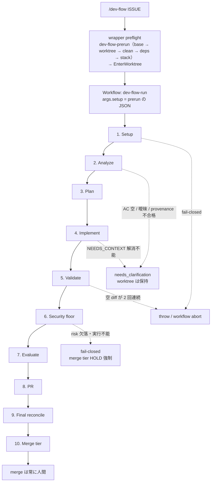

破線は正常系から外れる経路。`needs_clarification` は worktree を保持したまま返るので、
人間が確認して `dev-flow-prerun` から再起動すれば同じ worktree が再利用される（`setup` は
再取得する — 前回の epoch を使い回すと isolation probe のファイル名が衝突して abort する）。

### 1.2 Setup

決定論処理（base 解決・worktree 作成/再利用と起点検証・`.devflow-tmp` clean・deps install・
stack 検出）は run 前に wrapper skill が top-level の Bash 1 コマンド `dev-flow-prerun` で済ませ、
その stdout JSON を `args.setup` として渡す。Setup phase で subagent を spawn するのは
isolation probe の 1 回だけ。

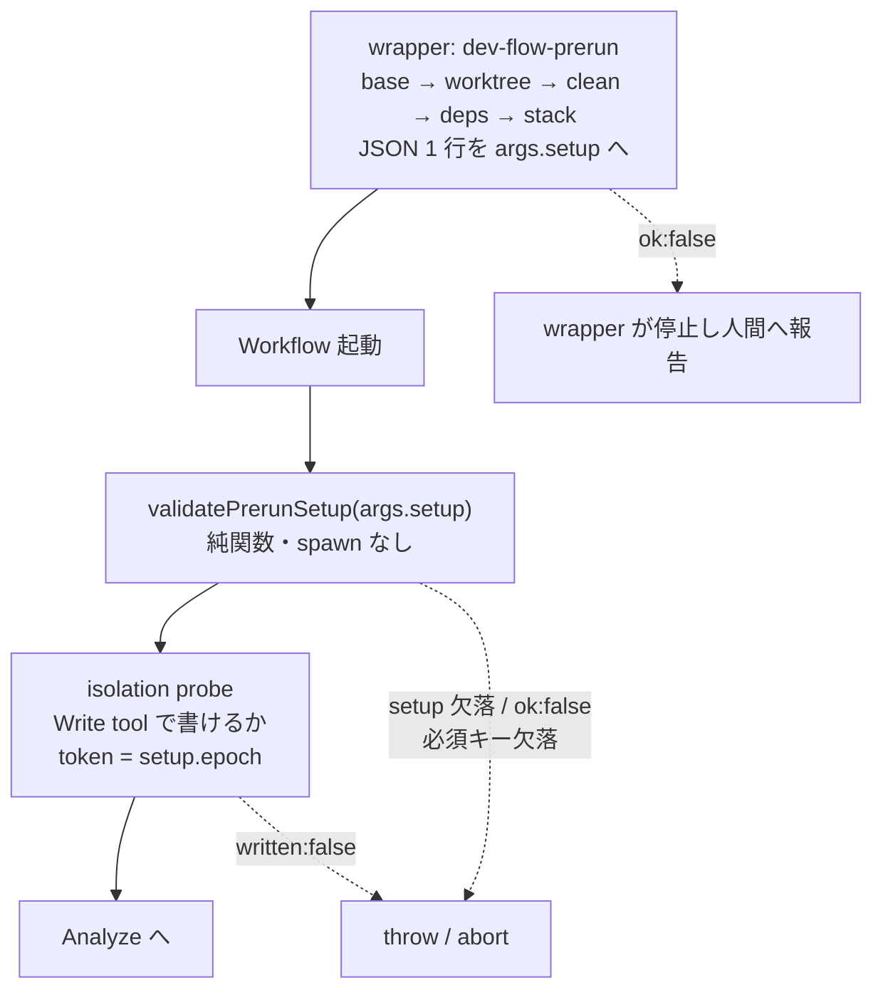

`dev-flow-prerun` の各段は独立に `ok:false` を報告し後続段を巻き込まない。base は明示指定なら
origin に存在するか検証、未指定なら `origin/dev` → `origin/HEAD` の順。既存 worktree は upstream が
`origin/BASE` と一致するか検証する。`args.setup` が無い・`ok:false`・必須キー欠落は workflow が
即 throw し、workflow 内 proxy への fallback は置かない（後方互換 scaffolding 禁止）。
worktree は repo 内 `.claude/worktrees/df-N` を優先し、書き込めない
（`worktree_status:"unwritable"`）場合のみ wrapper が repo 外 `repo-wt/df-N` で prerun を再実行する。
isolation probe は wrapper で代替しない — subagent の Write 経路が通ることの検証であり、
top-level の Bash では意味が変わる。

### 1.3 Analyze

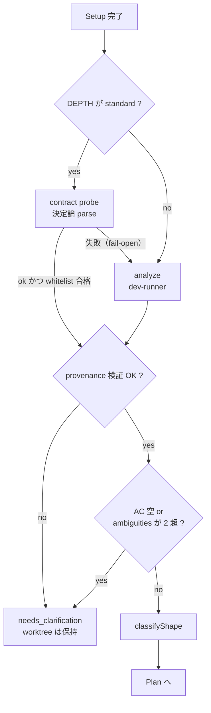

contract 経路は `analyze-issue.sh --contract` の出力を決定論 parse する高速経路で、
失敗しても sonnet の analyze へ fail-open で落ちる。provenance 検証は analyze 結果が
実際の issue 取得に基づくことを突き合わせる fail-closed のゲートで、捏造した要件を
Implement へ流さないためにある。

### 1.4 Plan

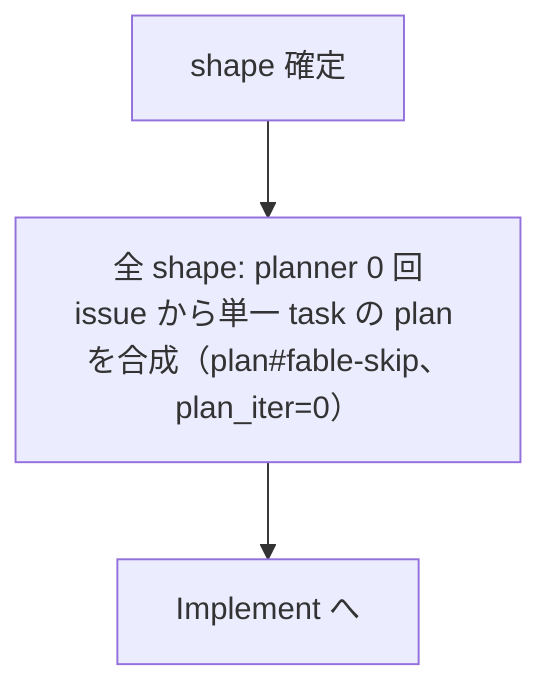

Plan phase は shape に依存しない。shape 判定は Evaluate の深さ・LITE gate・refloor のために残る。
合成 task の `file_changes` は空で始まり、Implement の返却 `files` を宣言として取り込む。

### 1.5 Implement

`dev-implement-fable`（plan+impl 統合）を単一 worktree に 1 spawn する。parallel fan-out・
issue 分割・integration branch は使わない。

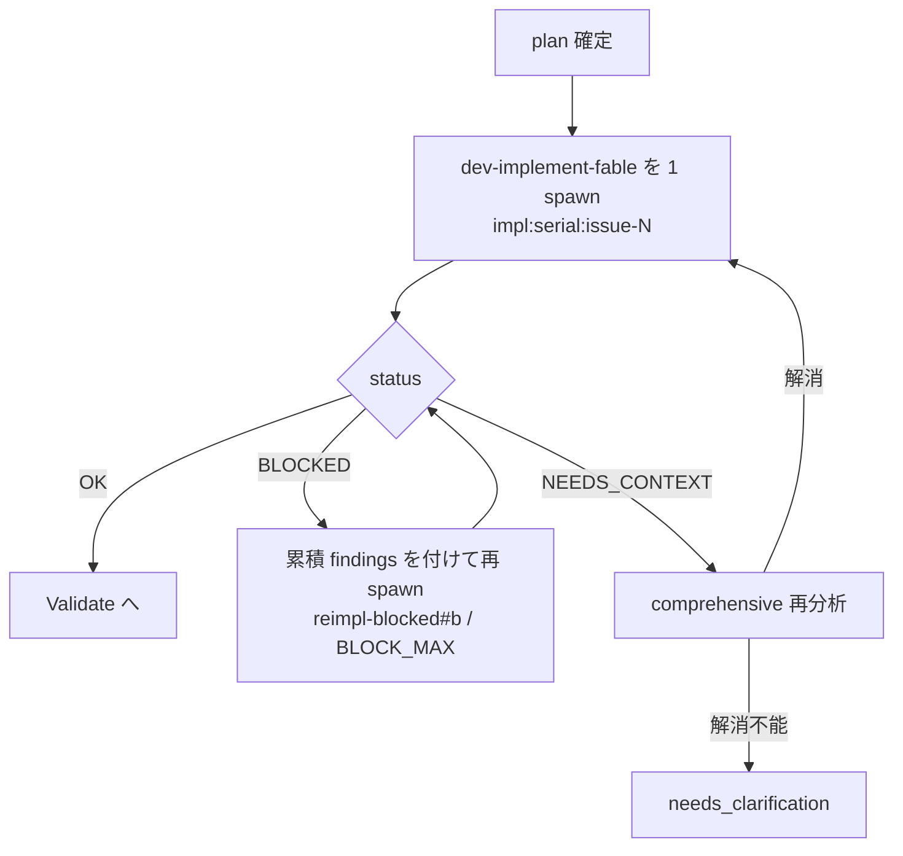

### 1.6 Validate

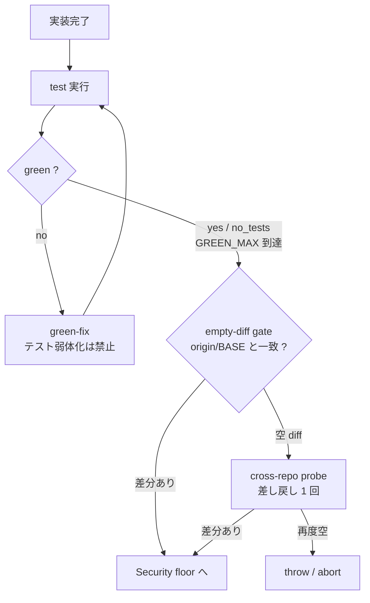

format / lint はこの phase の責務外で、test の結果だけを見る。
`GREEN_MAX` 到達時は red のまま次へ進むが、未解消の状態は merge tier が HOLD で受け止める。

### 1.7 Security floor

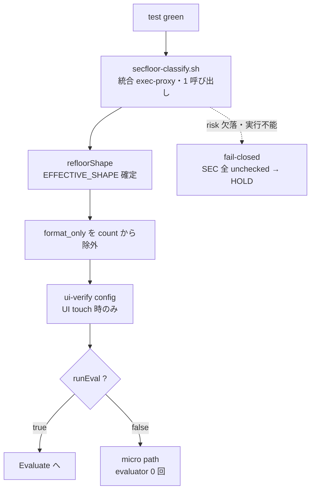

`secfloor-classify.sh` は risk（danger-grep）/ files（realized diff）/ struct（structural 分類）/
diffhash を 1 回で返す。フィールドごとに失敗セマンティクスが分かれており、**risk の欠落だけは
fail-closed** で SEC seed を全 unchecked にして merge tier を HOLD へ倒す（軸A invariant）。

`runEval` が true になる条件は次のいずれか。

- `EFFECTIVE_SHAPE` が micro 以外
- danger-grep hit / test-weakening 検出 / plan 宣言外の変更
- green-fix が発生した / dev-implement-fable が null を返して task を落とした / UI パスを touch した

### 1.8 Evaluate

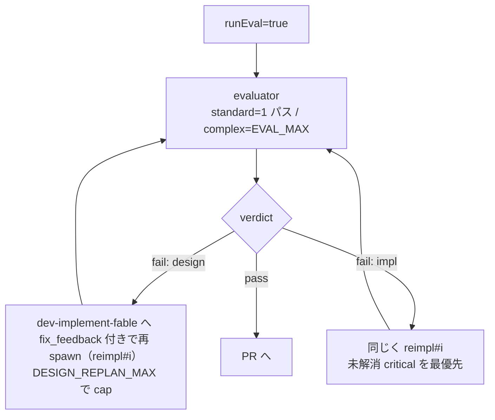

standard は 1 パスのみで差し戻さない。未解消の critical は merge tier の HOLD が担保する。

### 1.9 PR

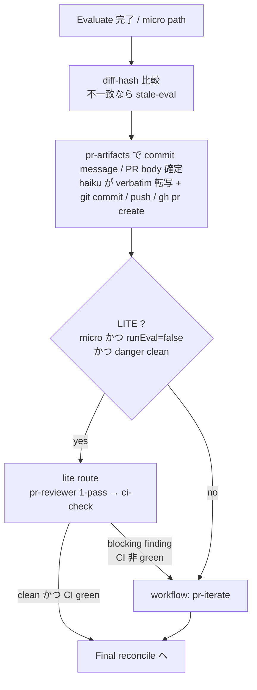

nested 起動する `pr-iterate` には issue の acceptance criteria と
nested context（cwd / head_ref / repo / epoch）を渡す。

### 1.10 Final reconcile

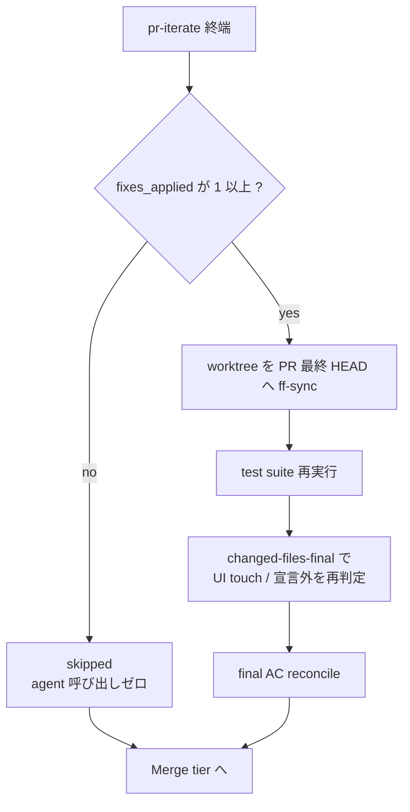

`changed-files-final` の結果は Merge tier へ持ち越され、同一 tree に対する再実行を skip する。

### 1.11 Merge tier

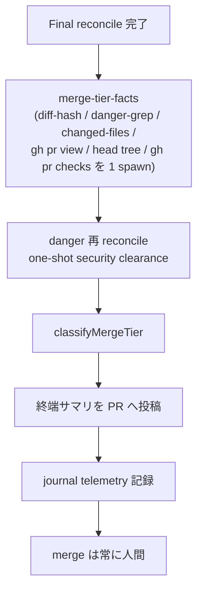

`merge-tier-facts` の diffhash が Security floor 時点の tree OID と一致すれば、facts の risk / changed
を使わず Security floor の結果を再利用する。tier の判定ロジックは [4. merge tier 判定](#4-merge-tier-判定) を参照。

---

## 2. shape 判定

shape は Analyze で `classifyShape` が決め、Implement 後に `refloorShape` が実 diff のファイル数で
再判定する。どちらも **raise-only** で、下げる経路は存在しない。入力が欠けていたり enum 外だったり
した場合は例外なく complex へ落ちる安全弁が効く。

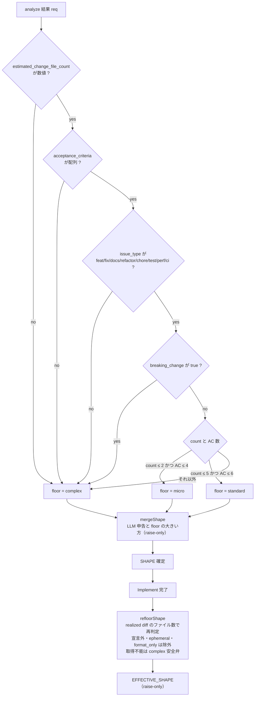

### 3 tier の経路差

| shape | Plan | Evaluate | merge tier |
| --- | --- | --- | --- |
| `micro` | issue から単一 task の plan を合成（`plan#fable-skip`、`plan_iter=0`）→ Implement で `dev-implement-fable` を 1 spawn | skip（evaluator 0 回）。danger-grep hit 時は security path で強制実行 | `AUTO`（docs・test-only + danger clean + 収束時のみ） |
| `standard` | 同上 | 1 パスのみ。差し戻しなし。未解消 critical は merge tier HOLD で担保 | `REVIEW` |
| `complex` | 同上 | 差し戻し loop（`EVAL_MAX` 上限、design 差し戻しは `DESIGN_REPLAN_MAX` まで。差し戻し先は同じ `dev-implement-fable`） | `REVIEW` / `HOLD`（danger・breaking 検出時） |

micro のうち `runEval=false` かつ danger clean のものだけが PR phase で **lite route** に入り、
pr-reviewer 1-pass と CI green だけで終端する。blocking finding か CI 非 green を検出した時点で
通常の pr-iterate へ自動昇格する。

---

## 3. pr-iterate ループ

`pr-iterate` は dev-flow から入れ子で呼ばれるほか、単体でも起動できる。approve が出ても
CI gate を通らなければ LGTM にならず、**CI pending を成功扱いすることは決してない**。
同じ topic が `REVIEW_STUCK` 回繰り返された時点で stuck と判定して人間へ渡す。

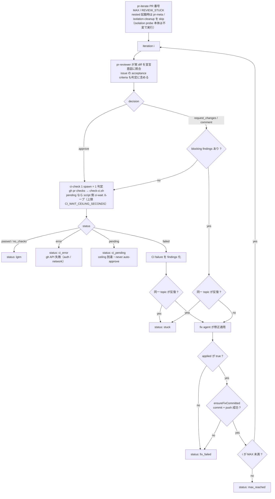

### 終端 status

| status | 意味 | dev-flow 側の扱い |
| --- | --- | --- |
| `lgtm` | review clean かつ CI passed / no_checks | Final reconcile へ。`fixes_applied` が 1 以上なら最終 tree を再検証 |
| `stuck` | 同一 topic が反復（review / CI failure） | merge tier `HOLD` |
| `fix_failed` | fix 未適用、または commit / push の保証に失敗 | merge tier `HOLD` |
| `max_reached` | `MAX` iteration で収束せず | merge tier `HOLD` |
| `ci_error` | gh API 失敗（auth / network） | merge tier `HOLD` |
| `ci_pending` | checks 未完了。自動承認しない | merge tier `HOLD` |

---

## 4. merge tier 判定

`classifyMergeTier` は純関数で、HOLD 理由の配列が空でなければ無条件に HOLD を返す。
AUTO は micro かつ docs/test-only かつすべての HOLD 条件が不成立のときだけで、それでも
「推奨ラベル」であり **merge 操作そのものは人間が行う**。

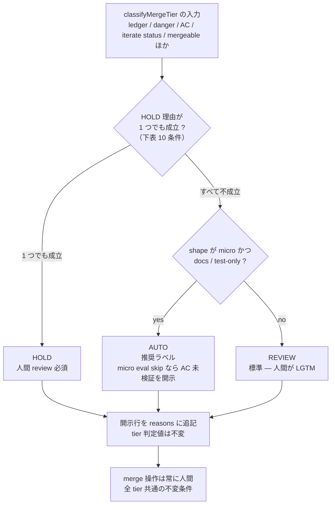

### HOLD 理由（1 つでも成立すれば HOLD）

| # | 条件 | 備考 |
| --- | --- | --- |
| 1 | ledger 未収束（未 checked の blocking item が残る） | |
| 2 | danger-grep hit 未解消 / 実行不能 | 実行不能は fail-closed |
| 3 | `breaking_change=true`（構造化判定） | keyword 単独 hit は不採用 |
| 4 | ESCALATE-TO-HUMAN 項目あり | |
| 5 | AC 未達 / Final AC reconcile 判定不能 | |
| 6 | Final reconcile 再検証不能 / final test red | |
| 7 | pr-iterate が `lgtm` 以外で終端 | |
| 8 | `eval_staleness = hash_mismatch` | 評価済み tree と merge 対象 tree の乖離 |
| 9 | test-weakening 未クリア | |
| 10 | base branch と conflict（`CONFLICTING` / `DIRTY`） | `UNKNOWN` は fail-open |

### gate_policy に依らず常に blocking

軸A invariant により、以下は `gate_policy` の設定に関係なく blocking のまま。

| 理由 | なぜ緩めないか |
| --- | --- |
| AC 未達 | `acceptance_criteria` が `satisfied:false` |
| Final AC reconcile 判定不能 | agent null / schema 不一致 / evidence 不足 |
| pr-iterate 非 LGTM 終端 | review ⇄ fix loop が LGTM 未到達 |
| `eval_staleness = hash_mismatch` | 評価済み tree と merge 対象 tree の乖離 |
| base branch conflict | `mergeStateStatus=DIRTY` / `mergeable=CONFLICTING` |
| danger-grep 実行不能 | security 未検証のまま出荷しない fail-closed |

`mergeable` が `UNKNOWN` の場合や proxy 失敗は fail-open で、definitive な `CONFLICTING` / `DIRTY` の
ときだけ HOLD する。breaking の keyword scan 単独ヒットは HOLD 理由に採用せず、構造化判定
`breaking_change=true` と組み合わさったときだけ blocking になる（単独ヒットは可視化のみ）。
evaluator が `verdict=fail` のまま PR へ進んだ run も同じ扱いで、開示行だけが reasons に入り
tier は動かない。

---

## 5. 定数と担当 agent

### ループ上限

<!-- atlas:loop-constants:begin -->

| 定数 | 値 | 効く場所 |
| --- | --- | --- |
| `EVAL_MAX` | 10 | complex の evaluate 差し戻しループ |
| `EVAL_STUCK` | 2 | 同一 topic 反復での design churn 打ち切り |
| `DESIGN_REPLAN_MAX` | 2 | design 差し戻し（replan + reimpl）の hard cap |
| `GREEN_MAX` | 3 | Validate の test green 差し戻し |
| `BLOCK_MAX` | 2 | BLOCKED 由来の再計画 |
| `AMBIGUITY_MAX` | 2 | 超過で needs_clarification |
| `REVIEW_STUCK` | 2 | pr-iterate の同一 topic 反復での stuck 判定 |
| `CI_WAIT_CEILING_SECONDS` | 300 | pr-iterate の CI pending 待ち（script 側 ci-wait ループ）の nominal 総待機上限（秒） |

<!-- atlas:loop-constants:end -->

この表の値は `plugins/dev-flow/_lib/atlas-constants.test.mjs` が実装ソースと照合する。
ソース側の定数を変えたらこの表も更新しないと CI が落ちる。

pr-iterate の `MAX`（review ⇄ fix 反復、既定 10）は `args.max_iterations` で上書きできるため
上表には含めない。

### subagent の役割分担

| agent | 役割 | model / effort |
| --- | --- | --- |
| `dev-implement-fable` | plan+impl 統合実装（全 shape の唯一の実装 agent。Implement・BLOCKED 再実装・green-fix・evaluator 差し戻しを担う） | fable / high |
| `evaluator` | 実装品質ゲート | `QUALITY_MODEL` / high |
| `pr-reviewer` | PR レビュー | `QUALITY_MODEL` / high |
| `dev-runner` | Skill 呼び出し（analyze / commit / PR） | frontmatter / high |
| `dev-runner-haiku` | 書き込み・Skill 呼び出しを伴う exec-proxy | haiku / low |
| `dev-runner-haiku-ro` | read-only exec-proxy | haiku / low |
| `dev-runner-haiku-wo` | isolation probe 専任（Write のみ） | haiku / low |

model は subagent の frontmatter を既定としつつ `agent()` の `opts.model` で per-call override する。
品質ゲート系 4 agent の model だけは `plugins/dev-flow/_lib/quality-model.mjs` の `QUALITY_MODEL` 定数で一括指定し、
`tools/sync-inlines.mjs` が workflow へ inline 生成する。

effort は subagent の frontmatter で固定している。harness 同梱の `workflow-authoring` リファレンスは
`agent()` の opts に `effort` を記載しているが、**本 harness で実際に適用されるかは未検証**である
（受理と適用は別物で、effort は subagent 側から観測できない）。`dev-flow-canary` の
`agent_opts_effort_accepted` probe で受理可否だけを測り、その結果を根拠に再判定する。

---

## 補足

dev-flow は Workflow に依存するため **Claude 専用**で、cross-vendor portability を放棄する
唯一の例外扱いである。

本ドキュメントは実装ソースから起こした図であり、仕様書ではない。
dev-flow 本体（`plugins/dev-flow/.claude/workflows/` / `plugins/dev-flow/.claude/agents/` /
`plugins/dev-flow/_lib/` / `tools/`）を変更したら、
この図も同じ PR で更新すること。変更の経緯は git log を参照。
